# Direct X Game Engine

An implementation and feature expansion of <a href="https://www.youtube.com/watch?v=XeLyqELshHM&list=PLv8DnRaQOs5-ST_VDqgbbMRtzMtpK36Hy">Pardcode's Direct X game engine</a> series.

Course and Lecture by Prof. Neil del Gallego

    <h2>Click to Watch Progression</h2>
    
    <h2>Previews</h2>
    <table align="center">
        <tr>
            <td align="center" width=50%>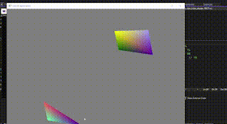</td>
            <td align="center" width=50%>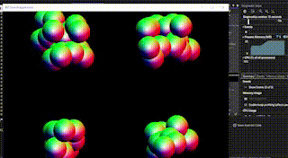</td>
        </tr>
        <tr>
            <td align="center" width=50%><h3>Animated Shapes</h3></td>
            <td align="center" width=50%><h3>View Bounds Collision</h3></td>
        </tr>
        <tr>
            <td align="center" width=50%>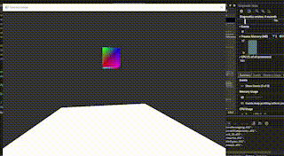</td>
            <td align="center" width=50%>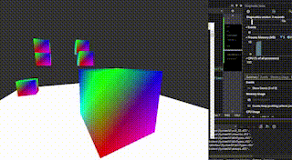</td>
        </tr>
        <tr>
            <td align="center" width=50%><h3>Cube Transformations</h3></td>
            <td align="center" width=50%><h3>Multiple Cube Instances</h3></td>
        </tr>
        <tr>
            <td align="center" width=50%>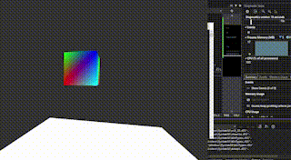</td>
            <td align="center" width=50%>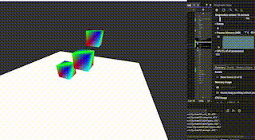</td>
        </tr>
        <tr>
            <td align="center" width=50%><h3>Fragment Shader Vertex Transforms</h3></td>
            <td align="center" width=50%><h3>Otrhographic Camera</h3></td>
        </tr>
        <tr>
            <td align="center" width=50%>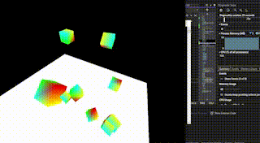</td>
            <td align="center" width=50%>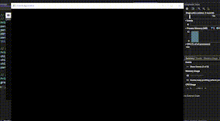</td>
        </tr>
        <tr>
            <td align="center" width=50%><h3>Disabled Depth Buffer</h3></td>
            <td align="center" width=50%><h3>Parenting Transforms</h3></td>
        </tr>
        <tr>
            <td align="center" width=50%>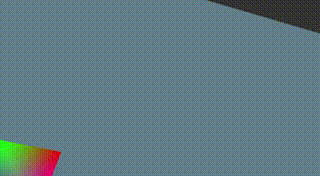</td>
            <td align="center" width=50%>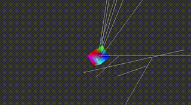</td>
        </tr>
        <tr>
            <td align="center" width=50%><h3>Raycast Select Objects</h3></td>
            <td align="center" width=50%><h3>Raycast Stop on First Hit</h3></td>
        </tr>
        <tr>
            <td align="center" width=50%>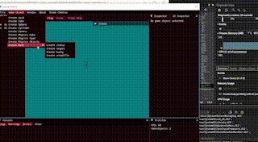</td>
            <td align="center" width=50%>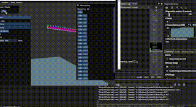</td>
        </tr>
        <tr>
            <td align="center" width=50%><h3>Import Objs and Textures</h3></td>
            <td align="center" width=50%><h3>Physics and Timestep</h3></td>
        </tr>
        <tr>
            <td align="center" width=50%>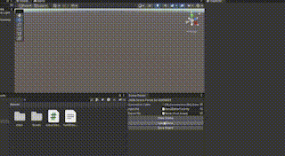</td>
        </tr>
        <tr>
            <td align="center" width=50%><h3>Import/Export Scenes to Unity and Unreal with Physics</h3></td>
        </tr>
    </table>

